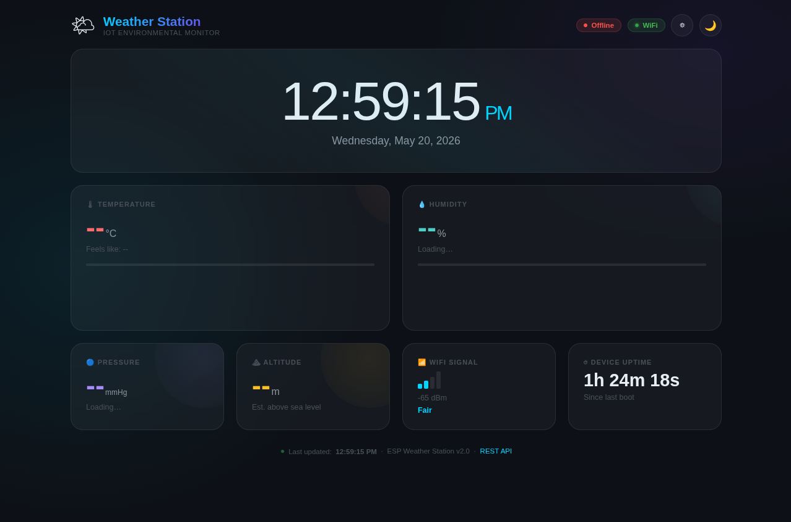
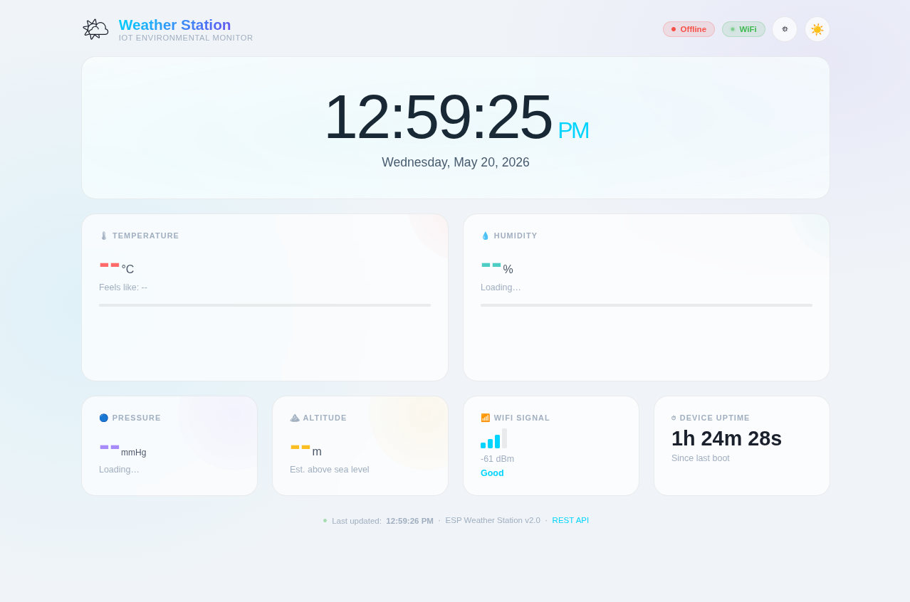
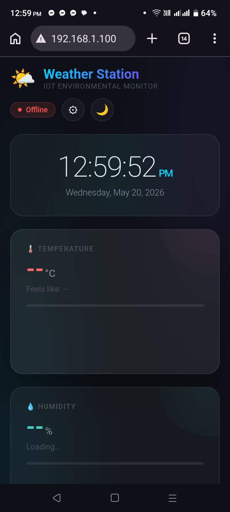
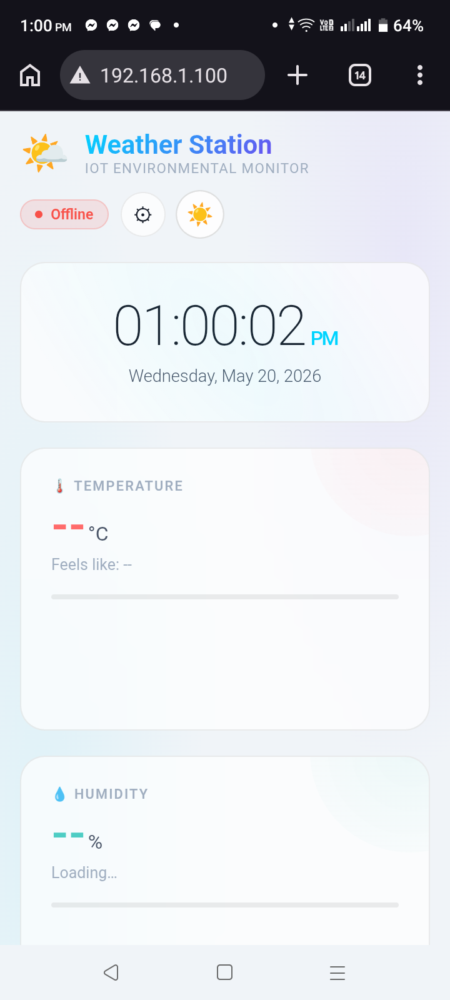

# ⛅ IoT Weather Station

> **Production-grade environmental monitor** built on ESP32 / ESP8266 + BME280 — featuring a glassmorphism web dashboard, WebSocket real-time updates, REST API, OTA firmware updates, and mDNS discovery.

[](#)
[](#)
[](#)
[](#)

---

## Table of Contents

- [Overview](#overview)
- [Features](#features)
- [Hardware Requirements](#hardware-requirements)
- [Wiring Diagram](#wiring-diagram)
- [Software Requirements](#software-requirements)
- [Library Installation](#library-installation)
- [Configuration](#configuration)
- [Board Settings](#board-settings)
- [Upload Instructions](#upload-instructions)
- [Linux USB Permission Fix](#linux-usb-permission-fix)
- [Dashboard & API](#dashboard--api)
- [REST API Reference](#rest-api-reference)
- [WebSocket Protocol](#websocket-protocol)
- [OTA Updates](#ota-updates)
- [mDNS / Local Hostname](#mdns--local-hostname)
- [PWA Support](#pwa-support)
- [Project Structure](#project-structure)
- [Troubleshooting](#troubleshooting)
- [Dashboard Preview](#dashboard-preview)
- [License](#license)

---

## Overview

This project turns a $5 ESP32 or ESP8266 microcontroller into a **fully self-hosted smart weather station**. It reads temperature, humidity, air pressure, and estimated altitude from a BME280 sensor and serves a beautiful, mobile-responsive web dashboard — no cloud, no subscription, no third-party dependencies.

The dashboard updates every second using WebSockets. It includes a sparkline temperature history chart, humidity drop visualizer, WiFi signal strength indicator, device uptime, weather condition mapping from barometric pressure, and a heat-index "feels like" temperature.

---

## Features

| Feature | Details |
|---|---|
| **Real-time dashboard** | WebSocket push every 1 second — zero page refresh |
| **NTP time sync** | 12-hour AM/PM format, configurable UTC offset |
| **Temperature** | °C reading + heat index ("feels like") |
| **Humidity** | % reading + human-readable comfort level |
| **Pressure** | mmHg + weather condition mapping |
| **Altitude** | Estimated metres above sea level |
| **Sparkline chart** | 15-minute temperature history (30 samples × 30s) |
| **WiFi indicator** | Signal strength bars + dBm + quality label |
| **Device uptime** | Days / hours / minutes / seconds since boot |
| **Dark / Light mode** | Toggle button, persists per session |
| **REST API** | `GET /api/data` returns full JSON snapshot |
| **OTA updates** | Push new firmware over WiFi — no USB needed |
| **mDNS** | Access via `http://weatherstation.local` |
| **PWA manifest** | Installable as a home screen app on iOS/Android |
| **Auto-reconnect** | WiFi drops re-attempt every 10 seconds |
| **Non-blocking** | Zero `delay()` calls — async architecture throughout |

---

## Hardware Requirements

| Component | Notes |
|---|---|
| **ESP32** (any variant) | Recommended — more RAM, dual-core |
| **— or — ESP8266** | NodeMCU 1.0 / Wemos D1 Mini supported |
| **BME280 sensor** | I2C interface (3.3V). *Not* BMP280 (no humidity) |
| **Micro-USB cable** | For initial upload |
| **Power supply** | 5V USB, phone charger, or power bank |

> **⚠ Important:** Use only the **3.3V** pin to power the BME280. The sensor is **not 5V tolerant** — connecting it to 5V will damage it permanently.

---

## Wiring Diagram

### ESP32

```
ESP32 Pin           BME280 Pin
─────────────────────────────────
3.3V  ──────────── VCC
GND   ──────────── GND
GPIO21 (SDA) ───── SDA
GPIO22 (SCL) ───── SCL
```

### ESP8266 (NodeMCU / Wemos D1 Mini)

```
ESP8266 Pin         BME280 Pin
─────────────────────────────────
3.3V  ──────────── VCC
GND   ──────────── GND
D2 / GPIO4  (SDA) ─ SDA
D1 / GPIO5  (SCL) ─ SCL
```

### Pinout visual

```
         ┌──────────┐
  3.3V ──┤ VCC      │
   GND ──┤ GND      │
   SDA ──┤ SDA      │  BME280
   SCL ──┤ SCL      │
         │ SDO→GND  │  (I2C addr 0x76)
         └──────────┘
```

> **I2C address:** `0x76` when `SDO` pin is tied to GND (default).  
> Change to `0x77` when `SDO` is tied to 3.3V. Update `BME280_I2C_ADDR` in the sketch accordingly.

---

## Software Requirements

- [Arduino IDE 2.x](https://www.arduino.cc/en/software) (recommended) or Arduino IDE 1.8.19+
- ESP32 board support package **or** ESP8266 board support package (see [Board Settings](#board-settings))

---

## Library Installation

Install **all six libraries** via **Arduino IDE → Tools → Manage Libraries…**

| # | Library Name | Search Term | Author | Notes |
|---|---|---|---|---|
| 1 | ESPAsyncWebServer | `ESPAsyncWebServer` | lacamera | Required for all |
| 2 | AsyncTCP *(ESP32 only)* | `AsyncTCP` | dvarrel | ESP32 only |
| 2 | ESPAsyncTCP *(ESP8266 only)* | `ESPAsyncTCP` | dvarrel | ESP8266 only |
| 3 | Adafruit BME280 Library | `Adafruit BME280` | Adafruit | Required for all |
| 4 | Adafruit Unified Sensor | `Adafruit Unified Sensor` | Adafruit | BME280 dependency |
| 5 | **Adafruit BusIO** | `Adafruit BusIO` | Adafruit | **Required — missing this causes `Adafruit_I2CDevice.h` error** |
| 6 | NTPClient | `NTPClient` | Fabrice Weinberg | Required for all |

> **⚠ Important notes:**
> - Install either `AsyncTCP` (ESP32) **or** `ESPAsyncTCP` (ESP8266) — **never both**. Wrong library = compile error.
> - When installing **Adafruit BME280** or **Adafruit BusIO**, Arduino IDE may ask **"Install all dependencies?"** — always click **"Install All"**.
> - If you get `fatal error: Adafruit_I2CDevice.h: No such file or directory` — it means **Adafruit BusIO** is missing. Install it from Library Manager.

### Common Library Errors & Fixes

| Error Message | Cause | Fix |
|---|---|---|
| `Not used: .../ESP_Async_TCP` | Wrong AsyncTCP for ESP8266 | Remove it, install `ESPAsyncTCP` instead |
| `fatal error: Adafruit_I2CDevice.h` | Missing Adafruit BusIO | Install `Adafruit BusIO` from Library Manager |
| `AsyncTCP.h not found` | Wrong AsyncTCP for ESP8266 | Install `ESPAsyncTCP` (not `AsyncTCP`) |
| `operator+ invalid operands` | ESP8266 strict C++ on char* | Already fixed in sketch with `String()` wrapper |

---

## Configuration

Open `WeatherStation.ino` and edit the **User Configuration** section near the top:

```cpp
// ★ Edit only this section ★

const char* WIFI_SSID       = "YOUR_WIFI_SSID";      // Your WiFi network name
const char* WIFI_PASSWORD   = "YOUR_WIFI_PASSWORD";  // Your WiFi password
const long  UTC_OFFSET_SEC  = 6 * 3600;              // UTC offset in seconds

const char* DEVICE_HOSTNAME = "weatherstation";       // → weatherstation.local
const char* OTA_PASSWORD    = "ota1234";              // Change before deploying!

#define BME280_I2C_ADDR   0x76   // 0x76 (SDO→GND) or 0x77 (SDO→3.3V)
#define SEA_LEVEL_HPA     1013.25f
```

### UTC Offset Reference

| Timezone | UTC Offset | `UTC_OFFSET_SEC` value |
|---|---|---|
| Bangladesh (BDT) | UTC+6 | `6 * 3600` = `21600` |
| India (IST) | UTC+5:30 | `19800` |
| Pakistan (PKT) | UTC+5 | `5 * 3600` = `18000` |
| UK (GMT/BST) | UTC+0 | `0` |
| US Eastern (EST) | UTC−5 | `-5 * 3600` = `-18000` |
| US Pacific (PST) | UTC−8 | `-8 * 3600` = `-28800` |
| Germany (CET) | UTC+1 | `1 * 3600` = `3600` |
| Japan (JST) | UTC+9 | `9 * 3600` = `32400` |
| Australia (AEST) | UTC+10 | `10 * 3600` = `36000` |

---

## Board Settings

### ESP32

Open **Tools** menu and set:

| Setting | Value |
|---|---|
| Board | `ESP32 Dev Module` (or your specific ESP32 board) |
| CPU Frequency | `240 MHz` |
| Flash Size | `4MB (Scheme: Default 4MB with spiffs)` |
| Partition Scheme | `Default 4MB with spiffs (1.2MB APP / 1.5MB SPIFFS)` |
| Upload Speed | `921600` |

#### Installing ESP32 board support (if not already installed):

1. Go to **File → Preferences**
2. Add to "Additional boards manager URLs":
   ```
   https://raw.githubusercontent.com/espressif/arduino-esp32/gh-pages/package_esp32_index.json
   ```
3. Go to **Tools → Board → Boards Manager**
4. Search `esp32` and install **"esp32 by Espressif Systems"**

---

### ESP8266 (NodeMCU / Wemos D1 Mini)

| Setting | Value |
|---|---|
| Board | `NodeMCU 1.0 (ESP-12E Module)` |
| CPU Frequency | `160 MHz` (higher = more stable async server) |
| Flash Size | `4MB (FS: 2MB, OTA: ~1019KB)` |
| Upload Speed | `921600` |

#### Installing ESP8266 board support:

1. Go to **File → Preferences**
2. Add to "Additional boards manager URLs":
   ```
   https://arduino.esp8266.com/stable/package_esp8266com_index.json
   ```
3. Go to **Tools → Board → Boards Manager**
4. Search `esp8266` and install **"esp8266 by ESP8266 Community"**

---

## Upload Instructions

1. **Install all 5 libraries** listed in [Library Installation](#library-installation)
2. **Edit** `WIFI_SSID`, `WIFI_PASSWORD`, and `UTC_OFFSET_SEC` in the sketch
3. **Connect** your ESP32/ESP8266 to your computer via USB
4. In Arduino IDE, select:
   - **Tools → Board** → your board
   - **Tools → Port** → the COM port (e.g. `COM3` on Windows, `/dev/ttyUSB0` on Linux)
5. Click the **Upload** button (→ arrow icon)
6. Open **Tools → Serial Monitor** and set baud rate to **115200**
7. After upload, the Serial Monitor will show:

```
╔══════════════════════════════════════╗
║   IoT Weather Station v2.0.0          ║
╚══════════════════════════════════════╝
[BME280] Sensor found at 0x76
[WiFi] Connecting to 'MyNetwork' ........
[WiFi] Connected!
[WiFi] IP:   192.168.1.42
[WiFi] RSSI: -62 dBm
[mDNS]  http://weatherstation.local
[NTP]   10:30:45 AM  Sunday, May 17, 2026
[OTA]   Ready — password: ota1234
[READY] Dashboard: http://192.168.1.42
[READY] REST API : http://192.168.1.42/api/data
```

8. Open your browser and navigate to the IP address shown, **or** `http://weatherstation.local`

---

## Linux USB Permission Fix

On Linux, the first upload attempt may fail with:

```
[Errno 13] Permission denied: '/dev/ttyUSB0'
```

or after a successful upload:

```
Error opening serial port '/dev/ttyUSB0'. Try consulting the documentation...
```

> ✅ **If you see the second error but the upload log shows `Hash of data verified.` — your code uploaded successfully!** The error is just the Serial Monitor failing to open, not the upload itself.

### Permanent Fix (Recommended)

Run this command in a terminal:

```bash
sudo usermod -a -G dialout $USER
```

Then **log out and log back in** (or restart your PC). After re-login, the permission is permanent — you won't need to repeat this.

```bash
# Verify you're in the dialout group:
groups $USER
# Should show: ... dialout ...
```

### Temporary Fix (No restart needed)

If you need to upload right now without logging out:

```bash
sudo chmod 666 /dev/ttyUSB0
```

> ⚠ This resets on every reboot. Use the `usermod` command above for a permanent fix.

### Serial Monitor Permission Fix

Even after upload, if Serial Monitor shows the permission error:

```bash
sudo chmod 666 /dev/ttyUSB0
```

Then in Arduino IDE: **Tools → Serial Monitor** → set baud rate to **115200**.

### Full Verified Upload Log (What Success Looks Like)

```
Chip is ESP8266EX
Uploading stub... Running stub... Stub running...
Auto-detected Flash size: 4MB
Writing at 0x00000000... (5 %)
...
Writing at 0x00044000... (100 %)
Wrote 405712 bytes (280353 compressed) in 6.8 seconds
Hash of data verified.        ← ✅ Upload complete
Leaving...
Hard resetting via RTS pin... ← ✅ ESP8266 restarted
```

---

## Dashboard & API

Once the device is running and connected to WiFi:

| URL | Description |
|---|---|
| `http://192.168.1.42/` | Main dashboard |
| `http://weatherstation.local/` | Same, via mDNS hostname |
| `http://192.168.1.42/api/data` | Full JSON snapshot (REST) |
| `http://192.168.1.42/api/history` | Temperature history array |
| `ws://192.168.1.42/ws` | WebSocket endpoint (real-time) |
| `http://192.168.1.42/manifest.json` | PWA manifest |

---

## REST API Reference

### `GET /api/data`

Returns a full JSON snapshot of all current readings:

```json
{
  "temperature": 26.5,
  "humidity": 72.3,
  "pressure": 756.2,
  "altitude": 8.5,
  "time": "10:30:47 PM",
  "date": "Sunday, May 17, 2026",
  "uptime": 8130,
  "rssi": -65,
  "sensorOk": true,
  "wifiOk": true,
  "history": [25.1, 25.3, 25.6, 25.8, 26.0, 26.3, 26.5]
}
```

| Field | Type | Unit | Description |
|---|---|---|---|
| `temperature` | float | °C | BME280 temperature |
| `humidity` | float | % | Relative humidity |
| `pressure` | float | mmHg | Atmospheric pressure |
| `altitude` | float | metres | Estimated altitude |
| `time` | string | — | 12-hour AM/PM formatted time |
| `date` | string | — | Full date string |
| `uptime` | int | seconds | Time since last boot |
| `rssi` | int | dBm | WiFi signal strength |
| `sensorOk` | bool | — | BME280 connected and reading |
| `wifiOk` | bool | — | WiFi connected |
| `history` | array | °C | Last 30 temperature readings |

**Response headers:**
```
Content-Type: application/json
Access-Control-Allow-Origin: *
Cache-Control: no-cache
```

### `GET /api/history`

Returns only the temperature history array:

```json
[25.1, 25.3, 25.6, 25.8, 26.0, 26.3, 26.5]
```

---

## WebSocket Protocol

Connect to `ws://<device-ip>/ws`

- On connect, the device immediately sends the full JSON payload (same schema as `/api/data`)
- Subsequent updates are pushed every **1 second** to all connected clients
- No messages need to be sent from the client — it's purely a push channel
- If disconnected, the dashboard automatically retries every 3 seconds

**Example (browser JavaScript):**
```javascript
const ws = new WebSocket('ws://192.168.1.42/ws');
ws.onmessage = (e) => {
  const data = JSON.parse(e.data);
  console.log(`Temp: ${data.temperature}°C  Humidity: ${data.humidity}%`);
};
```

---

## OTA Updates

After initial USB upload, all future firmware updates can be pushed **over WiFi**:

1. In Arduino IDE, go to **Tools → Port**
2. Under "Network ports" you should see `weatherstation at 192.168.x.x`
3. Select that network port
4. Click **Upload** — you will be prompted for the OTA password
5. Enter the password set in `OTA_PASSWORD` (default: `ota1234`)

> **Security note:** Change `OTA_PASSWORD` to something strong before deploying in any shared network environment.

---

## mDNS / Local Hostname

The device broadcasts itself as `weatherstation.local` on your local network.

| Platform | Support |
|---|---|
| macOS | Native — works immediately |
| iOS | Native — works immediately |
| Linux | Requires `avahi-daemon` (usually pre-installed) |
| Windows | Requires [Bonjour](https://support.apple.com/kb/DL999) (free, from Apple) |
| Android | mDNS support varies by app/browser — use IP address if `.local` fails |

You can change the hostname by editing `DEVICE_HOSTNAME` in the configuration section.

---

## PWA Support

The dashboard ships with a Web App Manifest (`/manifest.json`), making it installable as a Progressive Web App on mobile devices:

- **iOS Safari:** Tap the Share icon → "Add to Home Screen"
- **Android Chrome:** Tap the menu (⋮) → "Add to Home Screen"

Once installed, it opens in standalone mode without browser chrome, resembling a native app.

---

## Project Structure

```
WeatherStation/
├── WeatherStation.ino       Main sketch
│   ├── Configuration        WiFi, timezone, OTA, sensor settings
│   ├── INDEX_HTML           Complete dashboard (HTML/CSS/JS) in PROGMEM
│   ├── MANIFEST_JSON        PWA manifest in PROGMEM
│   ├── connectWiFi()        Boot-time WiFi connection with retry
│   ├── checkWiFi()          Background reconnect loop
│   ├── readSensor()         BME280 polling with NaN guard
│   ├── pushHistory()        Ring-buffer temperature logger
│   ├── buildJSON()          Assembles full JSON payload string
│   ├── getTime12h()         NTP → 12-hour AM/PM string
│   ├── getDate()            NTP → full date string
│   ├── onWSEvent()          WebSocket connect/disconnect handler
│   ├── setupOTA()           ArduinoOTA config with callbacks
│   ├── setupServer()        AsyncWebServer routes
│   ├── setup()              Hardware init, WiFi, mDNS, NTP, OTA, server
│   └── loop()               Non-blocking timer-driven main loop
└── README.md                This file
```

---

## Troubleshooting

### BME280 not found

```
[BME280] *** NOT FOUND *** — check wiring & I2C address
```

- Verify VCC is connected to **3.3V** (not 5V)
- Double-check SDA/SCL wiring against the [Wiring Diagram](#wiring-diagram)
- Try changing `#define BME280_I2C_ADDR 0x76` to `0x77`
- Run an I2C scanner sketch to detect the device address

### WiFi won't connect

- Verify the SSID and password (they are case-sensitive)
- Ensure your router broadcasts on **2.4 GHz** — ESP devices do not support 5 GHz
- Avoid special characters like `"`, `\`, or `$` in the password — if present, escape them
- Move the device closer to the router for initial setup

### `weatherstation.local` doesn't resolve

- Windows: install [Bonjour](https://support.apple.com/kb/DL999) from Apple
- Use the device's IP address directly (shown in Serial Monitor) as a fallback

### Dashboard doesn't update / WebSocket errors

- Open browser DevTools (F12) → Console tab — look for WebSocket errors
- Try a private/incognito window or disable browser extensions/ad blockers
- Ensure only one device on the network runs the same mDNS hostname

### Compile error: Wrong AsyncTCP library

```
Not used: /home/.../libraries/ESP_Async_TCP
```

- This means you installed `ESP_Async_TCP` or `AsyncTCP` for an **ESP8266** board
- Delete the folder from `~/Arduino/libraries/`
- Install **`ESPAsyncTCP`** (by dvarrel) instead — this is the correct one for ESP8266
- Never install both `AsyncTCP` and `ESPAsyncTCP` at the same time

### Compile error: `Adafruit_I2CDevice.h` not found

```
fatal error: Adafruit_I2CDevice.h: No such file or directory
```

- The **Adafruit BusIO** library is missing
- Go to **Tools → Manage Libraries** → search `Adafruit BusIO` → Install
- When prompted "Install all dependencies?" → click **Install All**

### Compile error: `operator+` invalid operands

```
error: invalid operands of types 'const char [12]' and 'const char*' to binary 'operator+'
```

- This is an ESP8266 strict C++ issue with string concatenation
- Already fixed in the current sketch by wrapping with `String(...)`
- If you see this, make sure you have the latest version of `WeatherStation.ino`

### Linux: Permission denied on `/dev/ttyUSB0`

```
[Errno 13] Permission denied: '/dev/ttyUSB0'
```

- See the full [Linux USB Permission Fix](#linux-usb-permission-fix) section above
- Quick fix: `sudo chmod 666 /dev/ttyUSB0`
- Permanent fix: `sudo usermod -a -G dialout $USER` then log out and back in

### OTA fails or port not visible

- Confirm ESP32/ESP8266 board support is version ≥ 3.x
- Ensure the partition scheme allocates OTA space (see [Board Settings](#board-settings))
- Firewall or antivirus may block UDP port 3232 (ESP32) or 8266 (ESP8266)

### Readings show `0.0` or `NaN`

- Sensor may be initialising — wait 3–5 seconds after boot
- Check power supply — if powering via a USB hub, try a direct port
- Add 4.7kΩ pull-up resistors on SDA and SCL lines if wiring is longer than ~30 cm

---

## Dashboard Preview

### 🖥 Desktop Mode (Dark Theme)



### 🖥 Desktop Mode (Light Theme)



> Toggle between dark and light mode using the **🌙 / ☀️ button** in the top-right corner.

---

### 📱 Mobile Mode (Dark Theme — Portrait)




### 📱 Mobile Mode (Light Theme — Portrait)



> On mobile, the 4-column bottom row **automatically reflows to 2×2 grid**. The hero clock font scales down with `clamp()` for all screen sizes.

---

### UI Feature Highlights

| Feature | Description |
|---|---|
| **Glassmorphism cards** | `backdrop-filter: blur` with translucent borders |
| **Dark / Light toggle** | One-click, instant switch via CSS `data-theme` attribute |
| **Sparkline chart** | Canvas-based Bézier curve, last 15 min of temperature |
| **Humidity drops** | Bar visualization that fills proportionally to humidity % |
| **WiFi bars** | 4-bar signal indicator coloured by dBm strength |
| **Number flash** | Values briefly dim-and-brighten on each update |
| **Loading screen** | Animated cloud icon + progress bar while WebSocket connects |
| **Reconnect overlay** | Blurred overlay with spinner if connection drops |
| **Heat index** | Rothfusz regression — only shown when T > 27°C and H > 40% |
| **Pressure label** | Maps hPa value to storm / unsettled / variable / fair / sunny |
| **Responsive** | Tested on 320px (small phone) to 1440px (desktop) |

---

## License

MIT License — free to use, modify, and distribute for personal and commercial projects.

---

*Built with ❤ for the maker community. If this project helped you, consider starring the repo and sharing it.*
